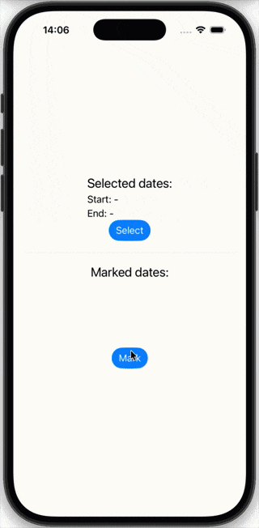

# CuteCalendar
`CuteCalendar` is a SwiftUI fullscreen calendar component with abilities to select and mark dates.

## Compatibility
`SwiftUI` app targeted to **iOS 16+**. For apps that supports `iOS 26` `CuteCalendar` offers `Liquid Glass` design as well.

## Motivation
During my career as iOS developer and working on my personal projects I've noticed that plenty of apps requiers a good, flexible, reliable and customizable calendar UI component which gives an ability to select date ranges or to manage and view user marked dates. While system's `DatePicker` is good, it does not supports selecting ranges nor ability to present a whole year(or several years) calendar. 

## What is CuteCalendar?
`CuteCalendar` offers a `SwiftUI` compatible component `CuteCalendarView` with a set of extension tools(such as for `Date`). `CuteCalendarView` intended for use within dedicated `.sheet()` or `.fullscreenCover`, but can be easely embedded in other `View` if needed.

<p align="center">

</p>

## Usage
`CuteCalendar` offers one main component which display a calendar in it - `CuteCalendarView`:

```swift
struct YourView: View {
    @State var startDate: Date?
    @State var endDate: Date?

    @State private var isPresented = false

    var body: some View {
        VStack {
            Button("Show CuteCalendatView") {
                isPresented.toggle()
            }
            .sheet(item: $isPresented) {
                CuteCalendarView(
                    presentableDates: Date.now.yearInterval()!,
                    selectableDates: Date.now.monthInterval(),
                    selectionStrategy: .range,
                    selectionStart: $startDate,
                    selectionEnd: $endDate
                )
            }
        }
    }
}
```

You manage `@State` variables for **selectionStart** and **selectionEnd** dates and pass them to component. **presentableDates** is a `DateInterval` which defines all dates that will be presented in component. **selectableDates** interval allows to select dates only within it. **selectionStrategy** desribes a way to treat user selection:
- `.range` for selecting date intervals
- `.single` for selecting individual dates
- `.mark` to mark dates
- `.none` to disable selection

You can extend `SelectionStrategy` protocol by conforming you own custom type if build-in types is not suitable for you.

### Customization
`CuteCalendarView` offers wide variaty of customization options via `SwiftUI` `Environment` such as colors, sizes, labels an more. To customize you can use a set of environment transform modifiers `.cuteXXX()`:

```swift
    CuteCalendarView(
        ...
    )
    .cuteTintColor(.orange)
    .cuteMarks(diameter: 7)
    ...
}
```

or you can set up all options at once using `cuteCalendarConfig()`:

```swift
    CuteCalendarView(
        ...
    )
    .cuteCalendarConfig { config in
        config.tintColor = .orange
        config.mark.diameter = 7
        ...
    }
}
```

### Marking dates
To use marking dates feature, you provide an [OrderedSet](https://github.com/apple/swift-collections) with marked dates to `CuteCalendarView`. Editing marks collection is possible with `.mark` `SelectionStrategy`, which writes user selected date to **selectionStart** variable. Then you can observe changes in this variable to modify a collection of marked dates:

```swift

struct YourView: View {
    @State var startDate: Date?
    
    @State var markedDate: Date?
    @State var markedDates: OrderedSet<Date> = []

    var body: some View {
        CuteCalendarView(
            presentableDates: Date.now.yearInterval()!,
            selectableDates: Date.now.monthInterval(),
            selectionStrategy: .mark,
            selectionStart: $markedDate,
            markedDates: markedDates
        )
        .onChange(of: markedDate) { date in
            handleSelectedMark(date)
        }
    }
}
```

## Install
`SPM` installation: in Xcode tap **File → Add packages…**, paste is search field the URL of this page and 
press **Add package**.
